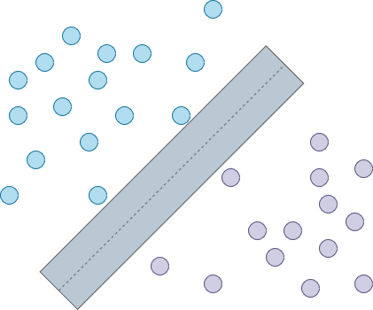

# Kernel Methods and Decision Trees

[Lecture slides](https://chalmers.instructure.com/courses/10918/files/1006817?module_item_id=135449)

Literature:

- Bishop, Patterns Recognition and Machine Learning,
  - Section 6: `intro, 6.1 - 6.2`
  - Section 7: `intro, 7.1.1 - 7.1.4`
  - Section 14: `intro, 14.4`

## Classification using Support Vector Machines

If we have these data points in the image below that are split into two groups. If we want to seperate the two classes we have to define boundaries that are typically a linear function. We can imagine that there will be multiple lines that satiesfy the defined condition.

Which decision plane is the best choice?

| A                         | B                         | C                         |
| ------------------------- | ------------------------- | ------------------------- |
|  |  |  |

C is the best options since it has the largest "margin" (wider decision plane) which results in better generalisation.

The Support Vecit Machines algorithm defines the optimal splitting _hyerplane_, and the datapoints closest to the splitting hyperplane are called **support vectors** (marked in red in the image above).

## No-Linear Problems

If we have data that can't be split using linear function, we can use Kernel tricks to _implicitly_ operate in high dimensional feature spaces to avoid learning non-linear functions.

## Parametric Models

**Fixed Basic Functions**: `φ(x) = (φ[1](x), ... φ[M−1](x))^⊤` (but we can have any type of function for our data).

It's used in:

- Linear regression: `y = a^⊤φ(x) + b`
- Linear classification: `y = f(a^⊤φ(x) +b )`

The models are "_trained_" using Maximum Likelihood Estimation, points estimation `(a, b)`, and specification of a posterior distribution `p(a, b | X, y)`. Once the models are trained, the data is _discarded_. The data is only represented by parameters `a` and `b`.

## Non-Parametic Models

There's no explicit parameters to be estimated, and we can work in high-dimensional (even infinite-dimensional) function spaces. The data is _not discarded_ after specifying the model, rather it's part of the model.

## Kernel Methods

Kernel methods use the data (or a subset) during predictions. The data enters via a kernel function `k(x′,x) = k(x,x′) = φ(x)^⊤ φ(x′)` &rarr; where x could be a datapoint and x' be another. The result is the inner product of the two vectors. The kernel measures the similarity between two points in the feature space defined by the function `φ(x)`.

### How do we choose and appropiate kernel?

- Choosing an optimal feature space is **non-trivial**
- The _kernel trick_ reduces this to choosing the best kernel, and determine the corresponding feature (_implicit_) mapping `φ(x)`.
- Kernel choice influnce performance of the algorithm
  - A good kernel can speed up the algorithm quite a lot
- The best kernel depends on the specific problem
- Kernels can be applied to:
  - **Numeric vectors** - Different transformation
  - **Strings** - for example DNA sequences or documents
  - **Graphs** - for example molecules, social networks

### Common Kernels - Radial Basis Functions

The RBF (Radial Basis Function) or _Guassian_ kernel takes the form of `k(x,y) = exp(- || x-y ||^2 / 2σ^2`. We have to show that `x⊤y` is a valid kernel.

## Support Vector Machines are Kernel Methods

**Advantages:**

- Works for classicifation as well as regression
- Works with high-dimensional space
- Works for two ore more classes (via one-vs-rest strategy)
- Good accuracy

**Disadvantages:**

- Slow on large datasets (compared to Naïve Bayes)
- Works poorly with overlapping classes
- Kernel type must be selected manually

## Decision Trees

Decision trees is a class of _regression_ and _classifictaion_ methods. They are called **trees** as they can be _interpreted_ and _visualised_ using a tree structured graph:

- Each **node** represents question/problem
- Each **branch** represents an answer/decision
- Each **leaf** represents a class label/response prediction

**Advantages:**

- Trees are very easy to explain to people. Infact, they are even easier to explain than linear regression.
- Some people believe that decision tree more closely mirror human decision-making than the regression and classification approaches.
- Trees can be displayed graphically, and are easily interpreted even by a non-expert.
- Treescan easily handle qualitative predictors without the need to create dummy variables.

**Disadvantages:**

- Unfortunately, trees do not have the same level of predictive accuracy as some of the other regression and classification approaches.
- Additionaly, trees can be very non-robust. In other words, a small change in the data can cause a large change in the final estimaed tree.

### From Data to Decision Tree

Decision tree can be built in many ways.

- Ask Q1 at the root, and Q2 everywhere at the next level, etc.
  - But in this way the tree will very big ca. `2^n` for `n` features/questions.
- Regularities in data can allow the trees to be smaller.

Every time we ask a **question** (add a branch to the tree), we split off a new area in our feature space. The more _homogenous_ the **response/class** it in an area, the less "_impure_" it is. Less _impurity_ should mean less variation within \*\*response/class/ &rarr; Results in better predictions.

### Building Trees

**Repeat splitting** in descending order until a pre-selected number of splits is reached. Do not split variables that do not improve purity/variance scors.

### Random Forests - An _Ensamble_ method

Random Forests combine the simplicity of decision trees with flexibility, resulting in a vast improvement in accuracy. Instead of making a classification or predecitions using a single tree, the forest decide instead. So we build many decision trees, resulting in a forest, and have a majority vote.

#### How to build a Random Forest

1. Start with the dsame dataset as you would with a decision tree
2. Sub-sample some random items (rows)
3. Sub-sample some random features (columns)
4. Build a tree based on the selected features from previous steps
5. Repeat until `N` trees are built.

The idea is that we generate an ensamble of methods, a distribution of different methods, that are independent of each other. The different methods specialise on different aspects, being better or worse at certain elements of decision. Can be better at minimising the impurity locally. Generally they minimise the variance of predictions.

#### How to use a Random Forest

- When we have a new datapoint we to predict, we query all the trees in the forest with the same question.
- We decide the result based on the majority of the answer of what the trees returned.

#### Random Forests - Pros and Cons

**Advantages:**

- Random Forest is considered as a _highly accureate_ and _robust_ method because of the number of decions trees participating in the process.
- The method does not suffer from the overfitting problem. The main reason is that it takes the average of all the predictions, which cancel out the biases.
- It can also handle missing values. There are two ways to handle those:
  - Using a median values to replace the continous variable
  - Computing the proximity-weighted average of missing values

**Disadvantages:**

- Random forests can be _slow_ in generating predictions because it has multiple decision trees.
- The model is _difficult to interpret_ compared to a dections tree, where tou can easily make a decision by following the path in the tree.
