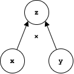

# Machine Learning and Neural Network

## The Perceptron: A Computational Model of a Neuron

Important functions of **neurons** include _relay of information_, _sensing the environment_, and _inducing an action_ (i.e. movement. Information flows from **dendrites** to terminal branches of the **axons**.

The **perceptron** is a computational model of a natural neron, and the output is computed as: `y = σ(∑[N, i=1] wi×xi + b)`

Some analogy to the biological neuron:

- Input &harr; Dendrites
- Summation + Activation &harr; Relay
- Output &harr; Axon

Only predicts values `y ∈ {0,1}`, has limited representative power. It's good for binary classifications and simple logical gates, such as determining wether photos are primarily black or white (mapping `black = 0`, `white = 1`).

## THe Multilayer Perceptron: A Neural Network

Every node (neuron) is a **perceptron**, where is sums over all input nodes `N`, adds a bias, and sends an output to the next layer (which can be another layer of perceptrons or the output of the network).

This is common in _Deep Learning_, which refers to building models with many layers (deep models. Activation functions are chosen depending on the problem.

### Universal Approximation Theorem

Networks with a single hidden layer can represent _any_ function `F(x)` with arbitrary accuracy in the large hidden layer size limit. Size is equal to the number of hidden units (nodes) in a layer. However, a given learning algorithm may be unable to (efficiently find an optimum with this accuracy. Networks with a single hidden layer can be inefficient in representing non-linear functions. Some examples require a number of hidden neurons that is exponential in the input size. For many datasets, deep networks can represent the function `F(x)` even with narrow layers.

### Training Neural Networks: Back Propagation

We have our model input `X[^]` (x-hats) with weights to the layers, and we get an out put `y[^](x[^]; θ)` that depends on the input and parameters of our model (theta). We can then define a loss function (in this case the squared loss) where we take the difference from our target value and the outcome value. The goal is to learn the parameters `θ` (weights and biases often illustrated as arrows) until the loss is **minimized**.

The general idea to solve this problem is to compute derivative of loss with respect to neural network output layer, and then back propagate derivatives through the network using the chain-rule. The weights and biases are then updated with the update rule: `δW[ij] = -ϵ(∂L / ∂W[ij]`, where &epsilon; is the '_learning rate_' that we chose to train the model.

### Computational Graphs

Computational graphs is what are being used under the hood of neural networks to calculate the outcomes. A sequence of mathematical operations are decomposed as a compute graph, for example `x × y` as seen in the figure below.


We start with our input values `x` and `y`, and then define a node that contains both the operations and the output of the calculations.

### Back-propagation: Forward Pass

The first part of the back-propagation algorithm is what's called _Forward Pass_.

We have the depth `l` of the network as well as initialized weights and biases for every layer. We then have the input `x` and the target output `y`.

```python

h(0) = x # the first layer is set to the input
for k = 1, ..., l do: # loop for every layer
    a(k) = b(k) + W(k)h(k-1) # biases plus the dot-product of the weights and output of previous layer
    h(k) = activation_func(a(k)) # output of the layer from the activation function
end for
y_hat = h(l) # output of the model is equal to the output of the final layer
J = loss_func(y_hat, y) + regularizer(parameters) # compute the loss J from a loss function with the output of the model and the target output. Also added is a regularizer

```

### Back-propagation: Backward Pass (INCOMPLETE)

Backward pass is when we propagate the loss all the way back to the neural network.

```python

g <- gradient(y_hat) * J = gradient(y_hat) * loss_func(y_hat, y)
for k = l, l-1, ..., 1 do:
    g <- gradient(a(k)) * J = g

```

### Stochastic Gradient Descent

The loss function landscape is _very rugged_, where minimizing from a random condition may get stuck in a sub-optimal point (or local minimum). We can give the optimizer a push to overcome the barriers by introducing some noise. We can overcome the problem my sampling a minibatch, instead of testing on the whole dataset. We then estimate the gradient for the minibatch by computing the loss with respect to the parameters, and then update the parameters with the estimation.

## Autoencoder: Loss Function

Autoencoder is just a feed-forward neural network trained to reproduce its input at the output layer.
