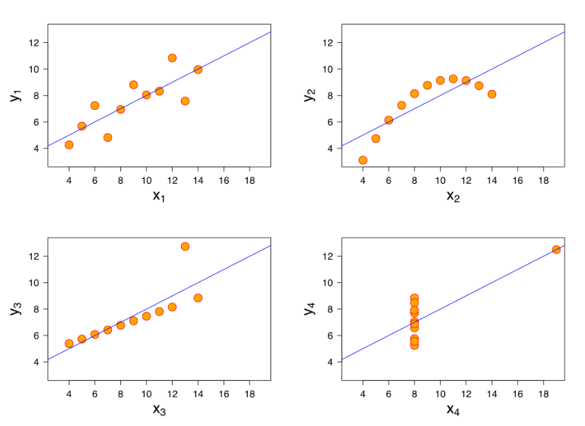
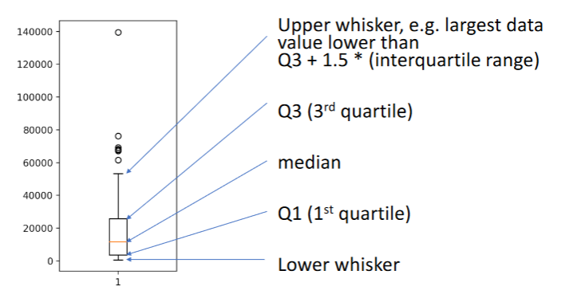
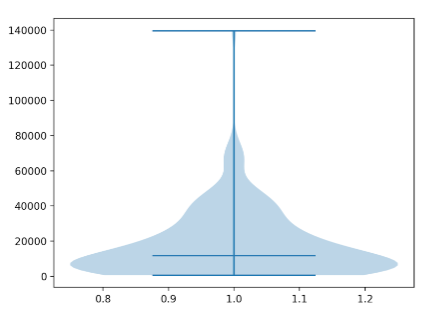
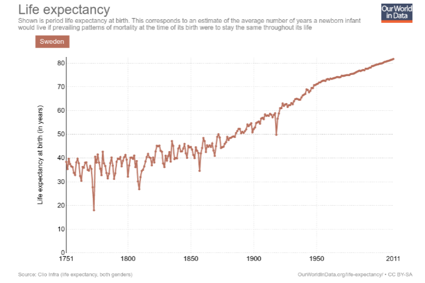

# Lecture 2 - Data Visualisation & Tools for Data Science and AI

[Lecture Slides](https://chalmers.instructure.com/courses/10918/files/887695?module_item_id=126042)

## Limits of Statistics

**Anscombe's quartet**

- Need to look how the data is plotted
- Even is they all have the same regression line, they will look very different

## Multi-Dimensional Objects

### Scatter Plot

- Colors and Sizes

### Box Plot

- Additional information than Histogram
- Can see the outliers

**Box Plot for Stratified Data**

-

### Violin Plot

- Similar information as Box Plot
- Also shows density at different values

## Develop a Visualisation Aesthetic

- Maximise data-ink ratio
- Minimise the lie factor
- Minimise chart junk
- Use proper scales and clear labelling
- Make effective use of colors
- Exploit the power of repetition

---

## _Case Study:_ Human Longevity

**Questions**

- What factors lead to incresas in human longevity?
- How should we spend resources to increase longevity?
- Whihc metrics should we use?

**Things to look out for**

- Bimodal distributions
- Stratification
- Different (interactive) visualisation styles

### Breaking Down Data

- Breaking down into age groups
- Plot the probability death from ages 0 to 99
- Plotting child mortality

### Insights

- Life expecancy is imopacted by:
  - Dying of "old age"
  - Dying before reaching adulthood
- Difference in life expetency between 1720-1920 largely dependent on reduction of child mortality
- Two groups of individuals and their proportions changed

### Possible Policy

- Must have explenations of what axes represent
- Units on both axes
