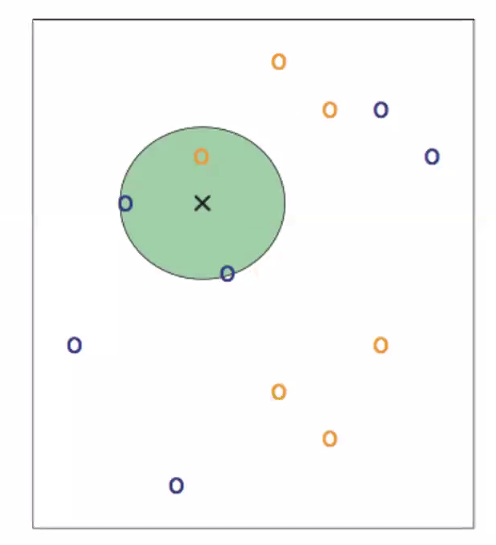
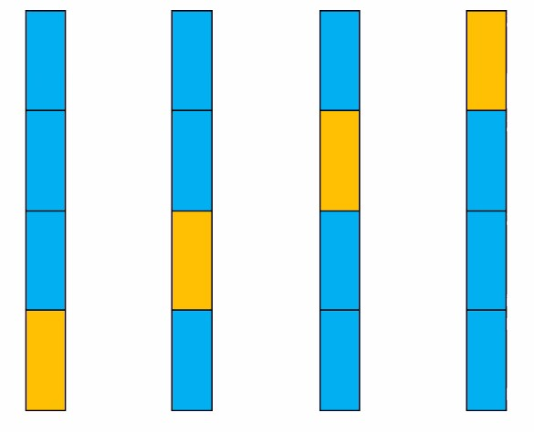
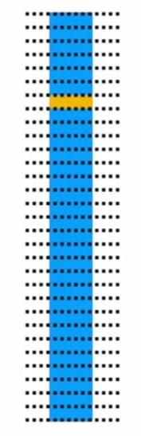

# Lecture 4 - Classification

## Regularization

To keep models simple for machine learning, based on Occam's Razor. It avoids large weights, where it encourage many 0 weights `small^2 << small`.

## Classifiers

**Examples**:

- K-Nearest Neighbours
- Logistic Regression
- Support vector machines
- decision tree classifiers/random forests
- Naive Bayes

### KNN-Classifier

Classifying multi-demensional data, where we want to build a classifier for a flower using multiple parameters such as petal length and width.

The KNN classifier gets the number of the nearest neighboroughs and calculate the distance from the target point and to the nereast neighbours in a cirtain radius.

The model will fit differently depending on what the K value is, with lower being overfitting and higher being underfitting.

#### Determining K in KNN

If there are two classes, an odd value for k ensures no tie.

If k is small, noise will have a greater influence; overfitting.

### Fitting models

#### Underfitting

If the model is too simple to capture the pattern in the data, such as fitting a straight line as model, it's called _underfitting._

#### Overfitting

On the other hand, if the model fitted to the data is too comlicated, it's called _overfitting_.

### Accuracy

First, data is split into two parts; training data and test data. One part is onlt meant for training and other for testing, since you want to test on previously unseen data. The data is sometimes split into three sections, with the new third part being validation data.

_Training Data_

### Using KNN

The _linear_regression_intro_ exanple can be used as the base for Assignment 2. K is _model.coef_ in the file. The file _knn_intro_ can also be used as the base for the assigment.

### Multivariate Logistic Regression

Is a one-neuron neural network.

If there are more than two classes, then _one-versus-the-rest_ can be used:

1. Train one logistic classifier for one vs another
2. Repeat with new classes
3. Repeat again with new classes

### Confusion matrix for multiple classes

Matrix with the true label on the y-axis and the predicted label on the x-axis.

## Evaluation Strategies

### How to split for training and test data

_Cross validation_, where the test part is moved around so that all data are being trained and tested for. If this is done then an average result is needed.

_Leave One Out_ can be used in extreme cases where each indvididual sample is called as a block.

