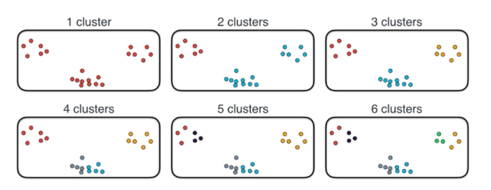
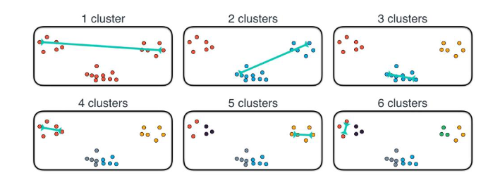

# Lecture 5 - Clustering

[Lecture Slides](https://chalmers.instructure.com/courses/10918/files/912928?module_item_id=129262)

### Assignment 1 - Summary

**Dealing with missing data**

- Add defualt values/fill in missing values
- Delete rows that have missing data
- Drop columns that have too many missing data
- Drop columns that are not needed for our analysis
- Delete rows that have values considered not appropiate for the analysis

## Purpose of Clustering

**Understanding**:

- Gain insights into data
- Generate hypothesis
- Identify salient features

**Structuring:**

- Idenfitfy taxonomies and phylogenetic relationships among data points

**Compression:**

- Organsise data
- Summarise data through cluser prototypes

## Applications of Clustering

**Clustering Organisms:** To understand natural evolution.

**Clusering Human Genome:** To understand migration and settlement patterns

**Clustering Faces:** Discover and diagnosing genetic disorder based on form of faces. Uses a "normal" face as a control and have known faces that are related to certain disorders. The analysed faces are matched against the trained data and therefor it can be estimated if or what disorder the face might have.

## Clusering Methods

### K-means

Parition into k clusers (global method). It's a greedy algorithm and it converges to a local minimum.

**Preparations:**

1. Choose value of k
2. Choose initial positions of the k cluster centres
3. Choose distance metric

#### Limitations of K-means

The result depends on the initialization.

#### Using K-means

### DBSCAN

Start at a point and build a cluser by joining its neighbor (local method)

### Hierarchical

Build bigger clusters by joining smaller clusters that are close together (global method)

### The Elbow Method

How do we pick _k_ (the number of clusters)?

Let the _diameter_ of a clustering be the longest intracluster distance (the longest distance between two points of the same color)

