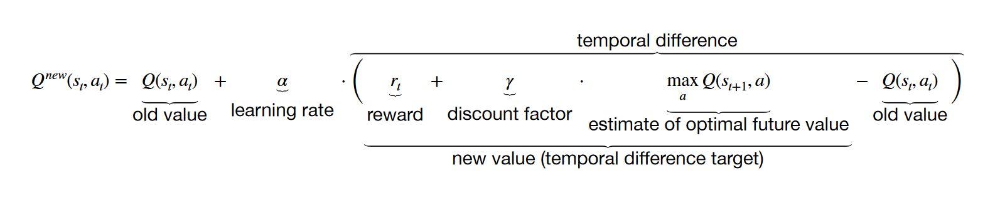

# Lecture 9: Statistical Methods in Data Science and AI

[Lecture Slides](https://chalmers.instructure.com/courses/10918/files/998932?module_item_id=134040)

[Open AI Gym](https://gym.openai.com/)

## Markov Model

### Markov Processes

#### Random Process

Is a function that varies with time and assings the outcome of a "random experiment" to each time-point, `t`. Can be any sequential structure, for example a text where a word follows another word.

#### Markov Process

Is a _random process_ where the next state only depends on the current state.

### Markov Chains

#### Markov Chain

Is a Markov process that jumps between discrete states, often also at _discrete_ time-points. Every time we jump from one tile to another in a grid, time has passed.

The random process, `x1, x2, x3, ...`, adopt **one** of the states `S = {s1, s2, ..., sn`, at any given time. The state `si` adopted by the process at `xt` is given by the _transition probability_ `p(si | sj)`, where `sj` is the state adopted by the process at `x[t-s]`. The initial state `x1 = si` of the Markov Process is given by the inital distribution `π = p(x1 = si)`.

#### Markos Property

`p(next state | all previous states) = p(next state | previous state)`

### Hidden Markov Model

A Hidden Markov model (HMM) can be distinguished with a _hidden random process_, such as a Markov Chain `h1, h2, ...` because it's generally not observed, and a _observed process_ that takes a random state conditioned on the state of the hidden process. This is typically a **non-Markovian**.

## Markov Decision Process (MDP)

Composed by a particular actor that makes actions on a an evironment with certain perceptions. It's a Markov Chain _augmented_ with **actions** and **rewards**. Given the environment/world state; an **agent** takes an action, the **world** jumps to a new state, and the **agent** recieves a reward.

### Solving MDPs

1. Find a policy that gives the maximum reward in the long run.
2. A policy is a set of _rules_ for which action to take in each state.
   1. state `s0` &rarr; action `a1`
   2. state `s1` &rarr; action `a0`
   3. state `s2` &rarr; action `a1`

## Reinforcement Learning

Reinforcement learning is learning by trial and error, via rewerds and punsihments. Almost all animals use it, including humans.

1. An MDP descibes the _interaction_ between the **agent** and the **environment**.
2. Usually the **agent** does _not_ have _full knowledge_ of the **environment**.
3. The **agent** _interacts_ with the **environment** to learn from it.

### Exploration-Exploitation

**Explore:** Taking a random action.

**Exploit:** Taking whatever aciton seems most rewarding at the present moment, while ignoring future consquences (greedy action).

### ε-greedy Algorithms

At each interaction:

- Explore with probability `1 - ε`.
- Exploit with probability `ε`.
- The threshold, `0 ≤ ε ≤ 1`, controls the exploration-exploitation balance.

### Exploration-Exploitation Trade-offs

Striking a _balance_ of **exploitation** and **exploration** is need for optimal performance.

- If we **exploit** all the time we might miss large parts of the state space, and end up in a _local optimum_
- If we **explore** all the time we don't learn from experience &rarr; no improvement

**Examples:**

- Pick berries at the usual place or try a new one?
- Go to the usual restaurant or try a new one?
- Stay in your apartment or move to a new one?
- Take your usual walk or try a new route?

## Accumulated Discounted Reward

Every **rewards** may be bettwe than later. This can be controlled via a _discount factor_ `γ ∈ [0, 1]`. The accumulated discounted reward becomes `Rt = rt + γ ⋅ r{t+1} + γ2 ⋅ r{t+2} + ...`. If `γ < 1`, the sum of rewards _converges_ even if the decision horizon is fine.

## Q-learning

In Q-learning (Q = "_quality_") we assign a value `Q(s, a)` to each initial state-action pairs `(s, a)`. We want to find a **policy** `π(s) = a` such that `π(s) = argmax{a}Q(s, a)`, i.e. in state _s_ we choose the action _a_ that maximizes the "_quality_" `Q(s, a)`.

Q-learning is an iterative procedure where an update at time _t_ is computed using the Bellman equation:

Q-learning may eventually find the **optimal policy** for any finite MDP, but the convergence may be very slow and table-based Q-learning has limited scalability.
