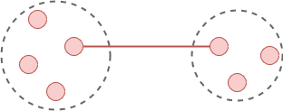
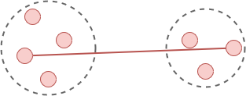
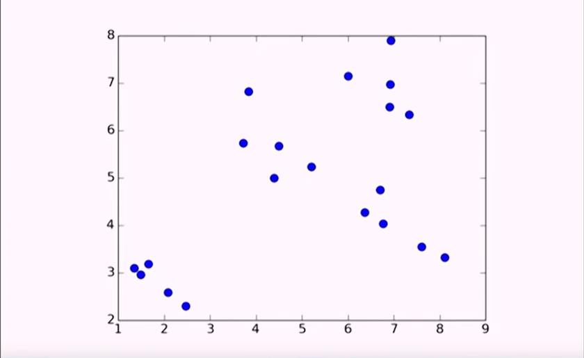
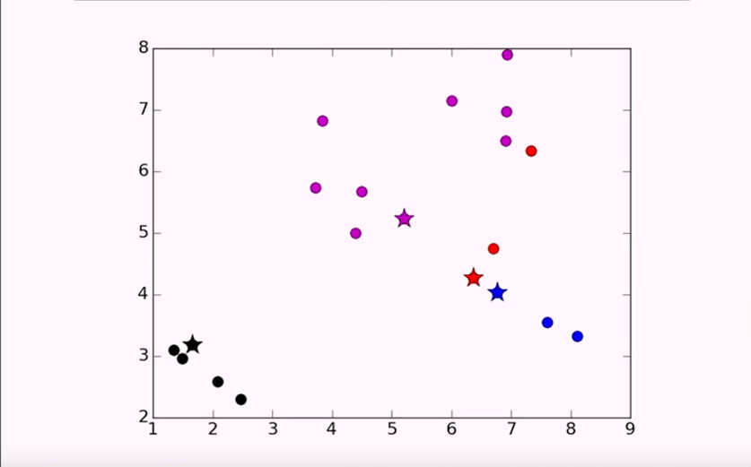
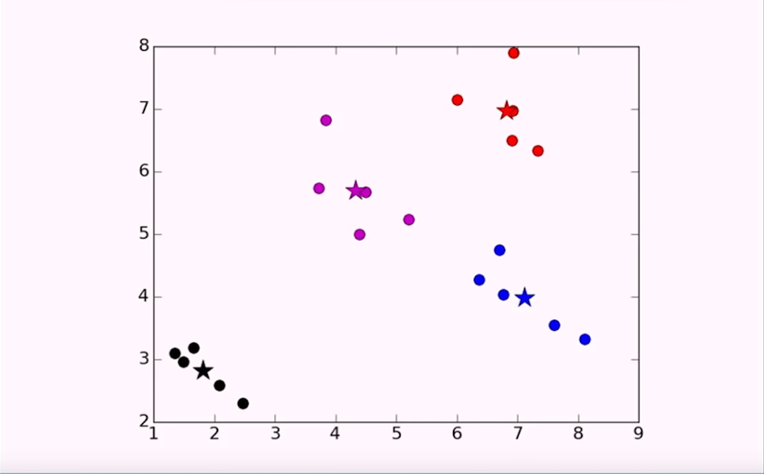

_This is from the MIT OpenCourseWare [video](https://www.youtube.com/watch?v=esmzYhuFnds)_

# 12. Clustering

MIT 6.0002 Introduction to Computational Thinking and Data Science, Fall 2016

By Prof. John Guttag

## Clustering is an Optimization Problem

`variability(c) = ∑(e∈c)distance(mean(c), e)^2`

`dissimilarity(C) = ∑(c∈C)variability(c)`

If variability is divided by the size of the cluster is variance, you would be normalizing it. The penalty of a big cluster with high variance is no higher than a tiny cluster with high variance. By not normalizing big and highly diverse clusters are penalized than small ones. Big and bad is worse than small and bad.

The best way for this problem is to assign each point to its own cluster, so we essentially have a cluster with only one point and therfore the dissimilarity is then 0. Clearly not a useful thing to do. To get around that: **Apply a contraint**.

Suitable constraints:

- set a minimum distance between clusters
- constrain the number of clusters (most common)

## Hierarchical Clustering

1. Start by assigning each item to a cluster, so that if you have _N_ items, now you have _N_ clusters, each containing just one item.
2. Find the closest (most similar) pair of clusters and merge them into a single cluster, so that now you have one fewer cluser. _N-1_ clusters.
3. Continue the process until all items are clustered into a single cluster of size _N_.

For this to be useful you usually stop somewhere before it becomes one single cluster. You often create a _Dendogram_ at each step at **2.** that shows what has been merged so far.

**The catch:** What's meant by distance?

### Linkage Metrics

These are some commonly used metrics in practise with different kinds of results depening on the application of the clustering.

**Single-linkage**: Consider the distance between one cluster and another cluster to be equal to the **_shortest_** distance from any member of one cluster to any member of the other cluster.



**Complete-linkage:** Consider the distance between one cluster and another cluster to be equal to the **_greatest_** disance from any member of one cluster to any member of the other cluster.



**Average-linkage:** Consider the distance between one cluster and another cluster to be equal to the **_average_** distance from any member of one cluster to any member of the other cluster.

### Example of Hierarchical Clustering

The air istance between different cities, and we want to cluster these airports depending on the distance.

|     | BOS | NY  | CHI | DEN  |  SF  | SEA  |
| --- | :-: | :-: | :-: | :--: | :--: | :--: |
| BOS |  0  | 206 | 963 | 1949 | 3095 | 2979 |
| NY  |     |  0  | 802 | 1771 | 2934 | 2815 |
| CHI |     |     |  0  | 966  | 2142 | 2013 |
| DEN |     |     |     |  0   | 1235 | 1307 |
| SF  |     |     |     |      |  0   | 808  |
| SEA |     |     |     |      |      |  0   |

Levels of clustering:

1. `{BOS}` `{NY}` `{CHI}` `{DEN}` `{SF}` `{SEA}`
2. `{BOS, NY}` `{CHI}` `{DEN}` `{SF}` `{SEA}`
3. `{BOS, NY, CHI}` `{DEN}` `{SF}` `{SEA}`
4. `{BOS, NY, CHI}` `{DEN}` `{SF, SEA}`
5. The next depends on the metric being used:
   - _Single-linkage:_ `{BOS, NY, CHI, DEN}` `{SF, SEA}`
   - _Complete-linkage:_ `{BOS, NY, CHI}` `{DEN, SF, SEA}`

### Summary of Hierarchical Clustering

It's a greedy algorithm that makes local optimal decisions at each point, which may or may not be globally optimal.

It's flexible since we can choose different linkage criteria that vary the results and can be adapted depending on the application.

But it's potentially really really slow, which means it's not an algorithm you want to use on large datasets. Using the single-linkage criteria the best complexity is `O(n^2)`.

## K-means Clustering

If you don't know how many clusters you want, this methods is problematic since it depends on you to define it. However, when you know how many clusters you want, it's much faster.

### K-means Algorithm

The most commonly used clustering algorithm since it works really fast.

```
randomly chose k examples as initial centroids

while true:
    create k clusters by assigning each example to closest centroid

    compute k new centroids by averaging examples in each cluster

    if centroids don't change:
        break
```

You don't know how many iteration you're gonna have, but the complexity of _one iteration_ is `k * n * d`, where **n** is number of points and **d** time required to compute the distance between a pair of points (likely to be dependent on the dimensionality of the features, such as Euclidian distance).

### Example of K-means Clustering

Initial plotting of data:


Choosing initial centroids at random, with `k=4`:


After 5 number of iterations until the centroids don't move we have:


### Issues with K-means

Choosing the "wrong" k can lead to strange results, which respect to the data.

Results can depend on the initial centroids from when they're randomly chosen. This can result to a different answer.

### How to Choose K

A _priori_ knowlege about application domain can be used for choosing the k. Example; there are two kinds of people in the world (k=2), or there are five different types of bacteria (k=5).

A better approach is to search for a good k. You try different values of k and then evaluate the quality of the results.

Or hierarchial clustering can be run on a subset of the data, and then get a sense of the structure of the underlaying data.

### Unlucky Initial Centroids

If the centroids happen to be close to eachother for some part of datapoints, but not on the rest, we might get a different result then we indended for. We can be "clever" and choose good initial centroids, to make sure that centroid are distributed across the space.

Use multiple sets of randomly chosen inital centroids and then just select the "best" results:

```
best = kMeans(points)

for t in range(numTrials):
    C = kMeans(points)

    if dissimilarity(C) < dissimilarity(best):
        best = C

return best
```

### Real K-means Example

Medical file with patient where we want to cluster them according to the probability of them dying of a heart attack, in some period of time.

_Features_:

- Heart reate in beats per minute
- Number of past heart attacks
- Age
- ST elevation (binary)

The outcome (death) is based to the features as in probability, e.g. older people with multiple heart attacks at higher risk.

Clustering the data and examine the purity of clusters relative to outcomes.

**Data Sample:**

|      | HR  | Att | STE | Age | Outcome |
| ---- | :-: | :-: | :-: | :-: | :-----: |
| P000 | 89  |  1  |  0  | 66  |    1    |
| P001 | 69  |  0  |  0  | 72  |    0    |
| P002 | 73  |  0  |  0  | 72  |    0    |
| P003 | 56  |  1  |  0  | 65  |    0    |
| P004 | 75  |  1  |  0  | 65  |    1    |
| P005 | 68  |  1  |  0  | 56  |    0    |

**Class Example:**

```python
class Example(object):

    def __init__(self, name, features, label = None):
    #Assumes features is an array of floats
    self.name = name
    self.features = features
    self.label = label

...

    def distance(self, other):
        return minkowskiDist(self.features, other.getFeatures(), 2)
        #2 = Euclidean distance

...
```

**Class Cluster:**

```python
class Cluster(object):

    def __init__(self, examples):
    #Assumes examples a non-empty list of Examples
    ...

    def update(self, examples):
    #Assume examples is a non-empty list of Examples
    #Replace examples; return amopunt centroid has changed
    ...

    def computeCentroid(self):
        #creates an array of all zeros. dimensionality = number of features
        vals = pylab.array([0]*self.examples[0].\dimensionality())

        for e in self.examples: #compute mean
            vals += e.getFeatures()

        centroid = Example('centroid', vals/len(self.examples))

        return centroid

    def variability(self):
        totDist = 0
        for e in self.examples:
            totDist += (e.distance(self.centroid))**2
        return totDist

    def members(self):
        for e in self.examples:
            yield e

...
```

**Class Paatient:**

```python
import cluster, pylab, numpy

class Patient(cluster.Example):
    pass

    def scaleAttrs(vals):
        vals = pylab.array(vals)
        mean = sum(vals)/len(vals)
        sd = numpy.std(vals)
        vals = vals - mean
        return vals/sd

    def getData(toScale = False):
        #read in data
        ...
        if toScale:
            hrList = scaleAttrs(hrList)
            ...
        #build points
        ...
        return points
```

The function _scaleAttrs_ is doing what's called Z-Scaling. This is really important when dealing with different features when clustering, that have different dynamic ranges. For examples, having features male=1 and female=0, along with wieght. The dynamic range of weight is much greater than the dynamic range of 0 to 1, which means that weight would dominate.

Another common way is to interpolate, where the smallest value is called 0 and the largest value i called 1. Then do linear interpolations for all the values between 0 to 1.

#### Results

Can be heavily influenced by the different features, providing different results depending on what number of k is being used. If it's consider to only be 2, as in "at risk" or "not at risk", the results might not be wanted. Testing different values of k can then show that it may need less or more clusters than initially predicted, where it was dependent on unknowns.
